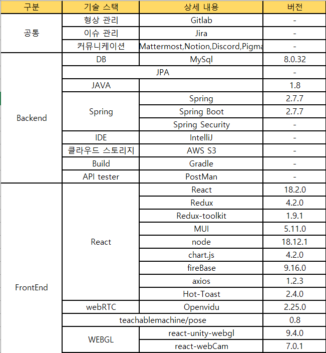
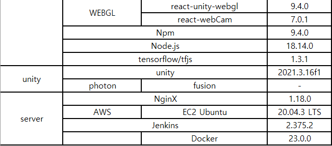
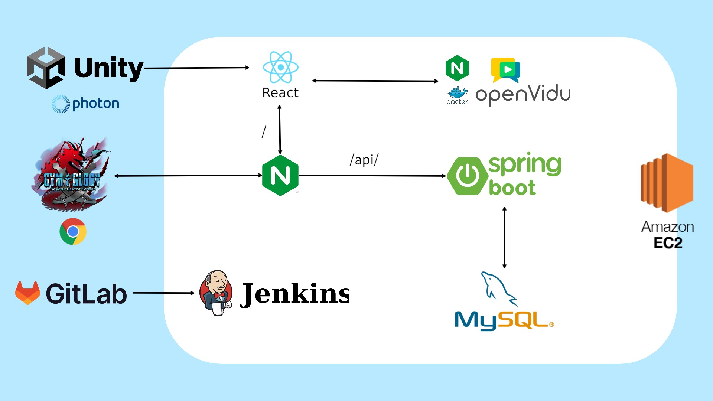
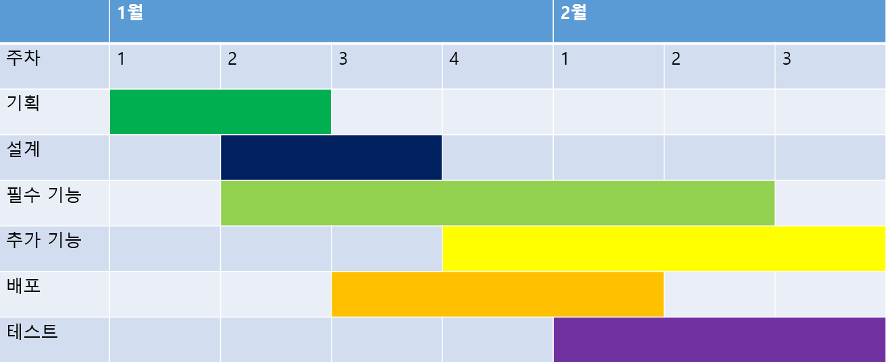
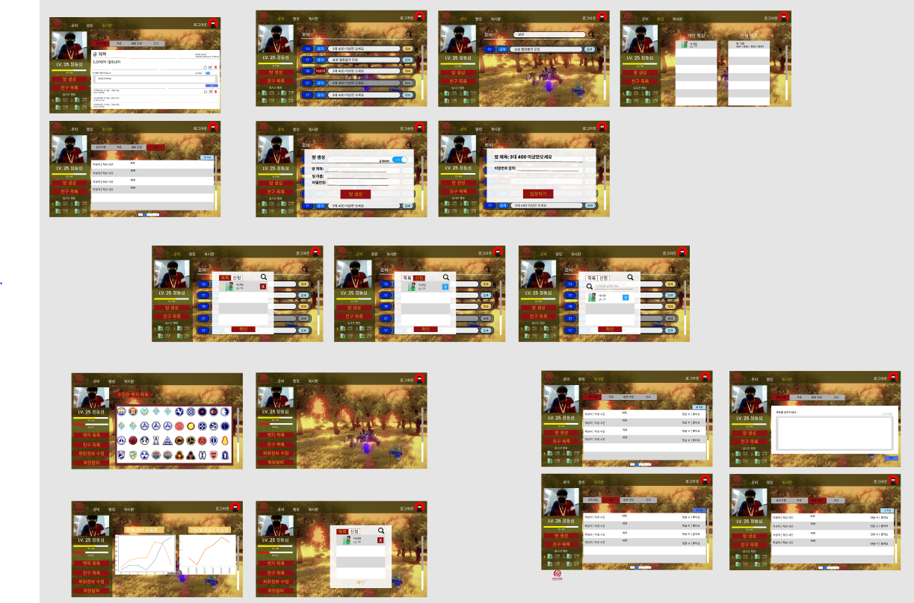

# 목차

1. [**서비스 소개**](#1)
2. [**기획 배경**](#2)
3. [**기능 소개**](#3)
4. [**시연 영상**](#4)
5. [**기술 스택**](#5)
6. [**프로젝트 일정 및 산출물**](#6)
7. [**개발 멤버 및 회고**](#7)

 

---

 

# 🌟서비스 소개

## 서비스 설명

### 개요

- 한줄 소개 : 용도 잡고 근육도 얻고 1석 2조
- 서비스 명 : **`GYM & GLORY`**

### 타겟 🎯

- 운동하고 싶은데, 헬스장 갈 돈이 없는 사람들
- 운동하고 싶은데, 헬스장 가기 귀찮은 사람들
- 운동하고 싶은데, 혼자 하기 싫은 사람들
- 운동하고 싶은데, 게임도 하고 싶은 사람들

> 👉 \*\* **여럿이서 집에서 편하게 운동하고 싶은 사람들** \*\*

# 🎞기획 배경

## 배경

경기 침체로 인해, 지갑이 가벼워진 사람들...
여름엔 덥고, 겨울엔 추워서 운동하로 나가기 싫은 사람들...
가볍게 운동하면서 친구도 만들고 싶은 사람들...

이 사람들이 건강하고 행복하길 바라는 마음에 만들게 되었습니다.
 
 
Gym & Glory의 장점은 다음과 같습니다. 
우선 게임 자체가 재밌습니다. 
그리고 외출할 필요가 없고, 돈 쓸 필요가 없습니다. 
마지막으로 이 게임은 협동심이 꼭 필요하기 때문에, 1~2판만 해도 사람들과 협동하면서 빠르게 친해질 수 있습니다.

## 목적 🧭

**재밌게 운동하면서 친구도 사귀자**

## 의의

- 협동심도 기르고 친구도 만들 수 있는 서비스
- 재밌게 운동하면서 나도 모르는 사이 건강해진다.
- 각 종 보상 및 랭크기능을 통해, 노력한 만큼 돌아오는 성취감

# 💫 기능소개 
(취합대기중)

# 📺 시연 영상

** https://www.youtube.com/premium **

# 🐳기술 스택

## 1. WebRTC

### WebRTC란?

<aside>
WebRTC (Web Real-Time Communication)는 웹 브라우저 간에 플러그인의 도움 없이 서로 통신할 수 있도록 설계된 API 입니다.
음성 통화, 영상 통화, P2P 파일 공유 등으로 활용될 수 있습니다. -출처 구글 위키피디아

</aside>

### openvidu

다양한 프레임워크와 호환성이 높을 뿐만 아니라 WebRTC를 소프트웨어 개발 키트(Software Development Kit, SDK)로 제공하기 때문에, 사용하기 편리하고 추가적인 커스터마이징을 통해서 고성능의 서비스를 구축할 수 있었습니다.

### 적용

`Gym & Glorty` 에서는 게임 화면 및 inGame에서의 원활한 소통을 위해 openVidu를 사용합니다.

## 2. Teachable Machine

### Teachable Machine이란?

<aside>
Teachable Machine은 구글에서 만든 웹기반 노코드 인공지능 학습 툴입니다. 이미지, 사운드, 자세를 인식하도록 컴퓨터를 학습시켜서 사이트, 앱 등에 사용할 수 있는 머신러닝 모델을 쉽고 빠르게 만들 수 있습니다.

Teachable Machine 은 크게 3가지 단계로 이루어집니다. 첫번째 ‘모으기’ 단계에서는 예시를 수집하여 컴퓨터가 학습하기를 원하는 클래스 또는 카테고리로 그룹화합니다. 그 후에는 ‘학습 시키기’를 통해 모델을 학습시켜서 새로운 예시를 올바르게 분류하는지 즉시 테스트해 보는 것이 가능합니다. 마지막으로 ‘내보내기’로 사이트, 앱 등 프로젝트에 대한 모델을 내보내게 되면 모델을 다운로드하거나 온라인으로 호스팅할 수 있습니다.
</aside>

### 적용

`Gym & Glorty` 에서는 사용자의 움직임을 인식하기 위해 n가지 과정을 거칩니다.

1.  각 운동에 대한 모델 학습 (스쿼트,런지,점핑잭,팔굽혀펴기)
2.  Teachable Machine과 리액트 연결
3.  운동 시 리액트에서 정확도 비교 후 운동 횟수 카운트 증가 및 유니티에 신호 전송

## 3. Docker

> 도커는 리눅스의 응용 프로그램들을 프로세스 격리 기술들을 사용해 컨테이너로 실행하고 관리하는 오픈 소스 프로젝트이다. 도커 웹 페이지의 기능을 인용하면 다음과 같다: 도커 컨테이너는 일종의 소프트웨어를 소프트웨어의 실행에 필요한 모든 것을 포함하는 완전한 파일 시스템 안에 감싼다.

## 4. NginX
> 가벼우면서도 강력한 프로그램을 목표로 러시아에서 개발되어 미국에서 운영 중인 오픈 소스 웹 서버 프로그램이다. '엔진엑스'라고 읽는다. HTTP와 리버스 프록시, IMAP/POP3 등의 서버 구동이 가능하다. Java 서블릿은 대개 Apache의 Tomcat을 연동해서 구동하고, PHP의 경우 PHP-FPM(FastCGI Process Manager)을 연동해서 구동한다. 그리고 웹 서버 소프트웨어로, 가벼움과 높은 성능을 목표로 한다. 웹 서버, 리버스 프록시 및 메일 프록시 기능을 가진다. 출처- 나무위키

## 5. JavaScript

> 자바스크립트는 객체 기반의 스크립트 프로그래밍 언어이다. 이 언어는 웹 브라우저 내에서 주로 사용되며, 다른 응용 프로그램의 내장 객체에도 접근할 수 있는 기능을 가지고 있다. 또한 Node.js와 같은 런타임 환경과 같이 서버 프로그래밍에도 사용되고 있다.

## 6. React

> 리액트는 자바스크립트 라이브러리의 하나로서 사용자 인터페이스를 만들기 위해 사용된다. 페이스북과 개별 개발자 및 기업들 공동체에 의해 유지보수된다. 리액트는 싱글 페이지 애플리케이션이나 모바일 애플리케이션 개발에 사용될 수 있다.

## 7. Spring

> 스프링 프레임워크는 자바 플랫폼을 위한 오픈 소스 애플리케이션 프레임워크로서 간단히 스프링이라고도 한다. 동적인 웹 사이트를 개발하기 위한 여러 가지 서비스를 제공하고 있다.

## 8. JPA(Java Persistence API)

> 스프링 프레임워크는 자바 플랫폼을 위한 오픈 소스 애플리케이션 프레임워크로서 간단히 스프링이라고도 한다. 동적인 웹 사이트를 개발하기 위한 여러 가지 서비스를 제공하고 있다.

## 9. 개발환경

## 10. 아키텍쳐 설계

# 📅프로젝트 일정 및 산출물

## 프로젝트 일정

## 프로젝트 진행
### 1. GitLab
---
Git flow 사용을 위해 `sourcetree` 프로그램을 사용하였고 해당 파트마다 개인적으로 브랜치를 생성한 후 중간에 merge 하는 방식으로 진행하였습니다. 이로 인해 컨플릭트를 최소화하고 오류가 생겼을 때, 리셋하기 편리했습니다. 

### 2. Jira
---
매일 오전 회의에서 데일리스크럼을 하고
 금주의 진행 이슈를 백로그에 등록했습니다. 전주에 완료하지 못한 이슈나, 앞으로 진행할 이슈들을 추가합니다.
 하지만 지속적인 추가 사항이 발생했기에, 그래프가 우하향 하지는 못합니다.
 
  

## 프로젝트 산출물
### 1. Figma

### 2. ERD

### 3. API 문서

# 🌈개발 멤버 및 회고

- [**이승한**]() : 긴듯했지만 아주 짧았던 6주가 지난 기분이다. 리액트를 처음 다뤄보아서 첫주는 리액트를 배운다고 시간을 다 허비했고 다들 리액트를 처음 다뤄봐서 각자 배운 스타일이 달라 코드 리뷰하는데 난항을 겪었던 것 같다. 하지만 프로젝트로 실전경험을 하면서 배우니 빠르게 느는 느낌을 받았으며 다음번에는 타입스크립트를 이용해서 개발해보고 싶다는 생각을 하게 되었다. 또한 여러 협업툴을 처음 사용해봐서 제대로 사용해보진 못해 아쉬웠으며 이번 프로젝트를 계기로 다음 프로젝트, 더 나아가 현업에서 훨씬 능숙하게 프로젝트를 진행 할 수 있는 능력을 키운것 같아서 뿌듯하다. 다들 고생하셨습니다~!

맡은 파트 : frontend(react) - 회원가입 및 로그인등 auth 관련 프론트 부분, 게시물 부분

- [**정동섭**]() : 처음에는 이게 가능할까라는 생각이 많았는데, 막상 부딪혀 보니 어떻게든 해결할 방법이 나타나서 
  놀라움이 끊이지 않았다. 프로젝트를 하면서 성장한 부분도, 나에게 아쉬운 부분도 많이 보이는데, 이를 바탕으로 다음에는 더 나은 프로젝트를 할 수 있을 것이라 생각된다. 무엇보다 어떤 문제든 해결해준 팀원들에게 고마움을 느낀다.

맡은 파트 : frontend 전반, teachable machine

- [**김유진**]() : 
  6주동안  길면 길고 짧으면 짧은 시간이었던 것 같습니다. 처음 EC2 서버 우분투 운영체제를 통해 서버를 구축하면서  Nginx, Jenkins, Docker, WebRTC 등 서버에 관한 CS정보가 요구했어서 많이 힘들었지만 무사히 구축되고 난 후 많은 보람을 느꼈습니다.
  6명 한 팀으로 인연으로 만나 처음 접한 기술임에도 불구하고 끝까지 포기하지 않고 기획한 웹 사이트대로 구현이 되어 팀워크와 커뮤니케이션의 중요성을 많이 배우고 깨달았습니다.
  6주간 팀원분들 모두 고생많으셨습니다! 다음 특화 프로젝트도 화이팅!!!

맡은 파트 : EC2 서버 인프라, WebRTC 서버 및 CI/CD 구축, SpringBoot JPA ORM, DB 구축

- [**유혜빈**]() : 프로젝트 시작한게 얼마 되지 않은 것 같은데 벌써 마무리 한다는게 놀랍다. 기획할 때 이게 될까 라는 생각으로 시작했는데 어느정도 우리가 기획한 것에 가깝게 결과물이 나와서 신기하다. 이렇게 6명이서 협업하면서 의사소통의 중요성을 좀 더 깨닫게 되었고 내가 좀 더 노력했으면 좋지 않았을까 후회가 남는다. 하지만 팀원들이 너무나 잘 해준 덕분에 나도 함께 프로젝트를 잘 진행했던거 같아 팀원들에게 너무 고맙다.

맡은 파트 : WebRTC 통신 프론트 부분, 게임방 구성, react unity 연결, teachable machine 관련 로직 등

- [**손수민**](https://github.com/SuminSon) : 멀티 게임을 처음 개발해봐서 상당히 나약한 게임을 만들었지만 재밌었습니다. 어울리는 웹을 잘 만들어주셔서 정말 감사드립니다. 기회가 되면 게임을 아예 뜯어고쳐서 안정성을 높여보고 싶습니다. 팀원분들로부터 많은 것을 배울 수 있는 시간이었습니다. 다들 고생하셨습니다!! 

맡은 파트 : Unity 게임 시스템, Photon 서버와의 통신, 웹 프론트 CSS

- [**이재호**]() : 이재호 :
아주 6주가 긴 것 같았는데, 실제로 짧게 느껴지진 않았다.
사람들이 맡은 바 역할을 끝까지 물고 늘어져서 만족스러운 결과물을 얻을 수 있었다. 팀에게 너무 감사하다. 이번 프로젝트를 통해서 다음프로젝트는 어떻게 해야할 지에 대한 가이드도 얻을 수 있었다. 지라를 처음 써봤는데, 사용법이 어려워서 제대로 관리를 못한것 같다. 승한님께 죄송하다.

맡은 파트 : spring boot, jpa, spring security, firebase(back) + jwt, Amazon S3, API제작,  backend 아키텍쳐, ERD, DB 구축

